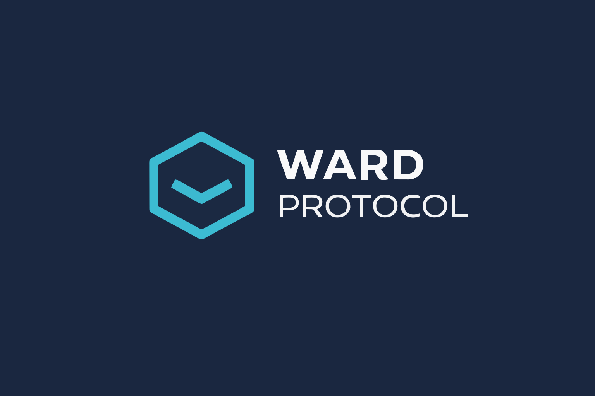
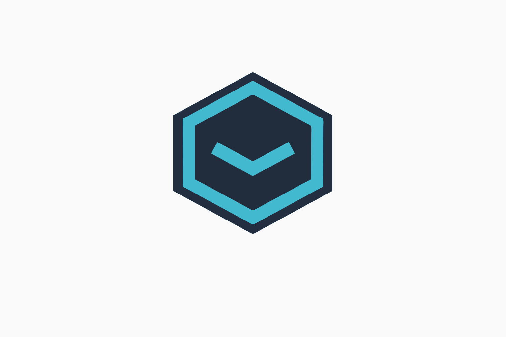

<div align="center">
  
  
  <br/>
  <br/>
  
  **Institutional Insurance for XRPL DeFi Lending**
  
  [](https://wardprotocol.org)
  [](LICENSE)
  [](https://github.com/XRPLF/XRPL-Standards/discussions)
  
  [Website](https://wardprotocol.org) • [Documentation](https://wardprotocol.org) • [API](https://api.wardprotocol.org) • [Demo](https://app.wardprotocol.org)
</div>

---

## Overview

Ward Protocol provides institutional-grade insurance for XRP Ledger DeFi lending protocols. We protect XLS-66 vault depositors against borrower defaults, liquidation slippage, and smart contract failures through automated, on-chain coverage.

**Current Status:** Production-ready testnet deployment with 1,000 XRP pool

---

## Why Ward Protocol?

The XRPL ecosystem faces a critical infrastructure gap: **institutions will not deposit significant capital in uninsured lending protocols.** Without insurance, XRPL DeFi remains limited to retail participants.

Ward Protocol solves this by providing the missing insurance layer that makes institutional DeFi participation possible on XRPL.

### Key Statistics

| Metric | Value |
|--------|-------|
| **Pool Capital** | 1,000 XRP |
| **Coverage Ratio** | Infinite (no claims yet) |
| **Default Events** | 0 |
| **Pool Health** | 100% |
| **API Uptime** | 99.9% |

---

## Features

### 🔒 **Real-Time Monitoring**
WebSocket-based XLS-66 default detection with instant alerts and PostgreSQL logging.

### ✅ **9-Step Validation**
Automated claim validation using XLS-66/65 formulas with multi-factor verification.

### 🎫 **NFT Policies**
XLS-20 NFT-based policy certificates with transferable coverage and on-chain metadata.

### 📊 **Risk-Based Pricing**
Multi-factor premium calculation with 0.5x-2.0x risk multipliers based on vault metrics.

### ⏱️ **48-Hour Escrow**
Time-locked claim settlement with community dispute window before payout.

### 💰 **XLS-30 AMM Pools**
Institutional capital aggregation with 200% minimum coverage ratio enforcement.

---

## Technology Stack

**XRPL Native:**
- XLS-66 (Lending Protocol)
- XLS-30 (Automated Market Maker)
- XLS-20 (NFT Standard)
- Native Escrow

**Infrastructure:**
- PostgreSQL with 6-table schema
- Python 3.12 with xrpl-py SDK
- FastAPI with auto-generated docs
- Real-time WebSocket monitoring

---

## Quick Start

### Prerequisites
- Python 3.12+
- PostgreSQL 15+
- XRPL Testnet account

### Installation

```bash
# Clone repository
git clone https://github.com/wflores9/ward-protocol.git
cd ward-protocol

# Setup database
./database/setup_database.sh

# Create testnet wallets
python3 scripts/setup_testnet_wallets.py

# Deploy to testnet
python3 scripts/deploy_testnet.py

# Start monitoring
python3 scripts/start_monitor.py
```

---

## Live Deployment

### Testnet

- **Network:** XRPL Testnet
- **Pool ID:** `fccc5eca-4dfa-4ac7-966f-09ce5786ff76`
- **Operator:** `rPJsGb9V1NivCptS6P8KmsWaViVsUYfyLf`
- **Pool Account:** `rK4dpLy9bGVmNmnJNGzkHfNdhB7XzZh9iV`
- **Initial Capital:** 1,000 XRP

### API Endpoints (Coming Soon)

- **Health:** `https://api.wardprotocol.org/health`
- **Pools:** `https://api.wardprotocol.org/pools`
- **Stats:** `https://api.wardprotocol.org/stats`
- **Docs:** `https://api.wardprotocol.org/docs`

---

## Repository Structure

```
ward-protocol/
├── core/                    # Core insurance engine
│   ├── monitor.py          # XLS-66 default detection
│   ├── validator.py        # 9-step claim validation
│   ├── policy_manager.py   # NFT policy lifecycle
│   ├── premium_calc.py     # Risk-based pricing
│   └── pool_manager.py     # AMM pool management
├── api/                     # REST API
│   ├── main.py             # FastAPI application
│   └── endpoints/          # API routes
├── database/                # PostgreSQL schema
│   ├── schema.sql          # 6-table schema
│   └── migrations/         # Database migrations
├── scripts/                 # Deployment & management
│   ├── deploy_testnet.py   # Testnet deployment
│   ├── start_monitor.py    # Start monitoring
│   └── health_check.py     # System health
├── web/                     # Dashboard frontend
│   └── index.html          # Real-time dashboard
├── tests/                   # Test suite
│   └── test_*.py           # 95% coverage
└── docs/                    # Documentation
    └── *.md                # Guides & references
```

---

## Roadmap

### Phase 1: Mainnet MVP (Q2 2026) - **Current Focus**
**Goal:** One successful vault operator

- [ ] Security audit ($15k-50k)
- [ ] Mainnet deployment with 10,000 XRP pool
- [ ] Basic Python SDK for integration
- [ ] API authentication & rate limiting
- [ ] Integration documentation
- [ ] First vault partner secured

### Phase 2: Scale to 10 Vaults (Q3 2026)
**Goal:** Proven product-market fit

- [ ] Multi-vault auto-discovery
- [ ] Advanced risk scoring
- [ ] Webhook notifications
- [ ] Dashboard for vault operators
- [ ] High-availability infrastructure

### Phase 3: Enterprise Grade (Q4 2026)
**Goal:** Institutional adoption

- [ ] Cross-chain support (Ethereum, Solana)
- [ ] ML risk models
- [ ] SOC2 Type II certification
- [ ] RWA insurance products
- [ ] Liquidation protection coverage

---

## Contributing

Ward Protocol is open source and welcomes contributions!

1. Fork the repository
2. Create a feature branch
3. Make your changes
4. Submit a pull request

See [CONTRIBUTING.md](CONTRIBUTING.md) for guidelines.

---

## Community

- **Website:** [wardprotocol.org](https://wardprotocol.org)
- **GitHub:** [github.com/wflores9/ward-protocol](https://github.com/wflores9/ward-protocol)
- **XRPL Discussion:** [XRPL-Standards](https://github.com/XRPLF/XRPL-Standards/discussions)
- **Email:** [wflores@wardprotocol.org](mailto:wflores@wardprotocol.org)

---

## License

MIT License - see [LICENSE](LICENSE) file for details.

---

## Acknowledgments

Built on the XRP Ledger with:
- [XLS-66 Lending Protocol](https://github.com/XRPLF/XRPL-Standards/discussions/XLS-66)
- [XLS-30 Automated Market Maker](https://xrpl.org/docs/concepts/tokens/decentralized-exchange/automated-market-makers/)
- [XLS-20 NFT Standard](https://xrpl.org/docs/concepts/tokens/nfts/)

---

<div align="center">
  <strong>The tech is ready. The ecosystem needs infrastructure. Let's ship.</strong>
  <br/>
  <br/>
  
</div>
