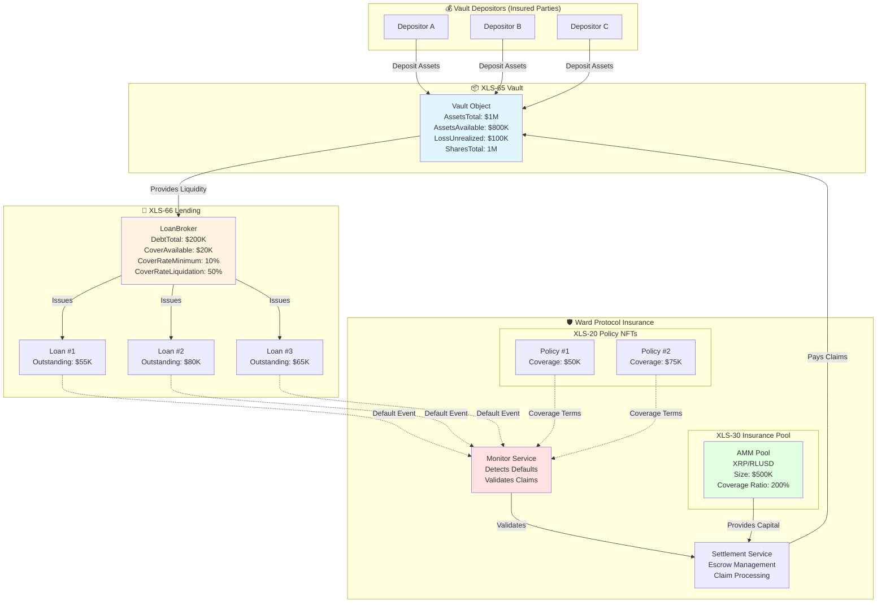
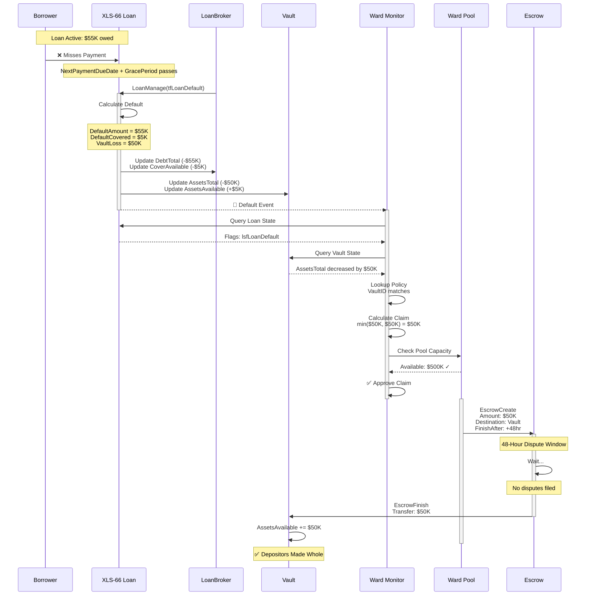
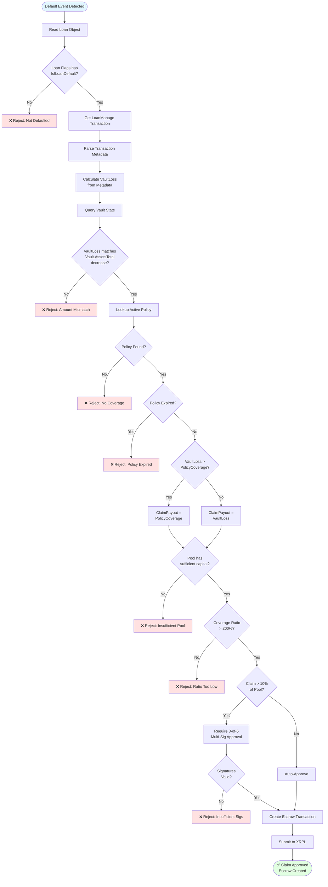
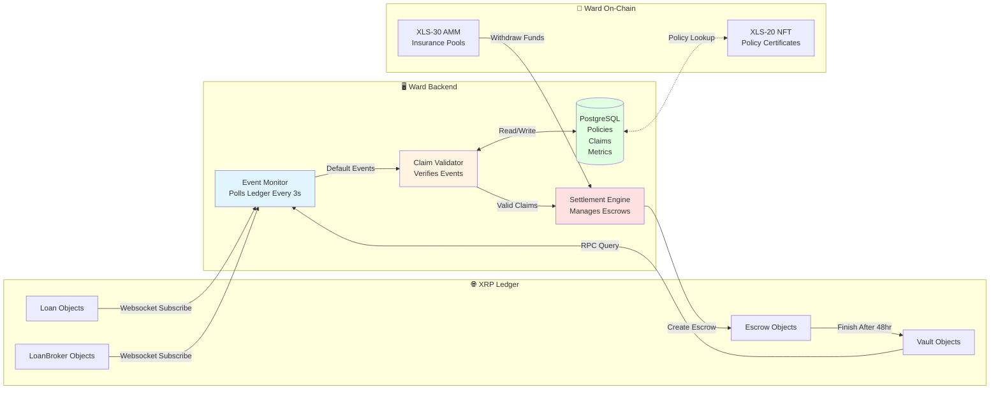

# Ward Protocol Integration Architecture

**Document Version:** 1.0  
**Date:** 2026-02-15  
**XLS Dependencies:** XLS-66 (Lending), XLS-65 (Vault), XLS-30 (AMM), XLS-20 (NFT)

---

## Table of Contents

1. [System Overview](#system-overview)
2. [ASCII Architecture Diagram](#ascii-architecture-diagram)
3. [Component Interaction Flow](#component-interaction-flow)
4. [Default Event Flow](#default-event-flow)
5. [Claim Settlement Flow](#claim-settlement-flow)
6. [Mermaid Diagrams](#mermaid-diagrams)

---

## System Overview

Ward Protocol provides insurance coverage for XLS-66 Lending Protocol depositors against losses that exceed First-Loss Capital protection. The system monitors XLS-66 LoanBrokers and their associated XLS-65 Vaults to detect default events and automatically settle claims.

### Key Integration Points

- **XLS-66 LoanBroker**: Monitor default events, track DebtTotal and CoverAvailable
- **XLS-65 Vault**: Monitor AssetsTotal changes, track depositor losses
- **XLS-30 AMM**: Ward insurance pool for capital aggregation
- **XLS-20 NFT**: Policy certificates with coverage terms

---

## ASCII Architecture Diagram

```
┌───────────────────────────────────────────────────────────────────────────────┐
│                           WARD PROTOCOL ECOSYSTEM                                │
└─────────────────────────────────────────────────────────────────────────────────┘

┌──────────────────────┐
│   Vault Depositor    │ ◄──── Insured Party
│   (Lender/LP)        │
└──────────┬───────────┘
           │ Deposits Assets
           │
           ▼
┌──────────────────────────────────────────────────────────────────────────────┐
│                         XLS-65 SINGLE ASSET VAULT                             │
├──────────────────────────────────────────────────────────────────────────────┤
│  AssetsTotal:      $1,000,000  (Total vault value)                           │
│  AssetsAvailable:    $800,000  (Liquid funds)                                │
│  LossUnrealized:     $100,000  (Impaired loans)                              │
│  SharesTotal:      1,000,000   (LP tokens)                                   │
│                                                                               │
│  Share Value = (AssetsTotal - LossUnrealized) / SharesTotal                  │
│              = ($1M - $100K) / 1M = $0.90 per share                          │
└──────────────────────────┬───────────────────────────────────────────────────┘
                           │
                           │ Provides Liquidity
                           │
                           ▼
┌──────────────────────────────────────────────────────────────────────────────┐
│                         XLS-66 LOAN BROKER                                    │
├──────────────────────────────────────────────────────────────────────────────┤
│  VaultID:              0xABC...123                                           │
│  DebtTotal:            $200,000  (Owed to vault)                             │
│  CoverAvailable:        $20,000  (First-loss capital)                        │
│  CoverRateMinimum:          10%  (10% of debt)                               │
│  CoverRateLiquidation:      50%  (50% of minimum cover)                      │
│  OwnerCount:                 10  (Active loans)                              │
│                                                                               │
│  Minimum Cover Required = $200K × 10% = $20K                                 │
│  Max Liquidation = $20K × 50% = $10K                                         │
└──────────────────────────┬───────────────────────────────────────────────────┘
                           │
                           │ Issues Loans
                           │
                           ▼
┌──────────────────────────────────────────────────────────────────────────────┐
│                            XLS-66 LOAN                                        │
├──────────────────────────────────────────────────────────────────────────────┤
│  Borrower:             rBorrower...                                          │
│  PrincipalOutstanding: $50,000                                               │
│  TotalValueOutstanding: $55,000 (Principal + Interest)                       │
│  NextPaymentDueDate:   2026-03-01                                            │
│  GracePeriod:          7 days                                                │
│  Flags:                lsfLoanDefault (if defaulted)                         │
└──────────────────────────┬───────────────────────────────────────────────────┘
                           │
                           │ DEFAULT EVENT
                           │ (Payment missed > GracePeriod)
                           │
                           ▼
┌──────────────────────────────────────────────────────────────────────────────┐
│                        DEFAULT CALCULATION                                    │
├──────────────────────────────────────────────────────────────────────────────┤
│  DefaultAmount        = $55,000  (Total owed)                                │
│  DefaultCovered       = min($10K, $55K, $20K) = $10,000                      │
│  VaultLoss            = $55,000 - $10,000 = $45,000                          │
│                                                                               │
│  ┌─────────────────────────────────────────────────────────────────┐        │
│  │  ⚠️  UNINSURED LOSS GAP: $45,000                                 │        │
│  │  This is what Ward Protocol insures!                            │        │
│  └─────────────────────────────────────────────────────────────────┘        │
└──────────────────────────┬───────────────────────────────────────────────────┘
                           │
                           │ Ward Monitors & Detects
                           │
                           ▼
┌──────────────────────────────────────────────────────────────────────────────┐
│                        WARD PROTOCOL INSURANCE                                │
├──────────────────────────────────────────────────────────────────────────────┤
│                                                                               │
│  ┌─────────────────────┐        ┌──────────────────────┐                    │
│  │   XLS-20 NFT        │        │   XLS-30 AMM         │                    │
│  │   Policy Certificate│        │   Insurance Pool     │                    │
│  ├─────────────────────┤        ├──────────────────────┤                    │
│  │ VaultID: 0xABC..123 │        │ Asset: XRP/RLUSD     │                    │
│  │ Coverage: $50,000   │        │ PoolSize: $500,000   │                    │
│  │ Premium: $500       │        │ LPTokens: 500K       │                    │
│  │ Term: 90 days       │        │ CoverageRatio: 200%  │                    │
│  │ PoolID: 0xDEF..456  │        │ ActivePolicies: 20   │                    │
│  └─────────────────────┘        └──────────────────────┘                    │
│                                                                               │
│  Coverage Calculation:                                                        │
│  ─────────────────────                                                        │
│  VaultLoss = $45,000                                                         │
│  PolicyCoverage = $50,000                                                    │
│  ClaimPayout = min($45,000, $50,000) = $45,000                               │
│                                                                               │
│  Settlement: Escrow → 48hr time-lock → Vault depositors                     │
└───────────────────────────────────────────────────────────────────────────────┘


LEGEND:
═══════
  ┌───┐
  │   │  Ledger Object
  └───┘

  ┌───┐
  │ ⚠ │  Critical Event / Loss
  └───┘

  ──►   Data Flow / Dependency
```

---

## Component Interaction Flow

```
┌──────────────┐
│  Depositor   │
└──────┬───────┘
       │
       │ 1. Deposits $100K to Vault
       │
       ▼
┌──────────────────────┐
│   XLS-65 Vault       │
│   AssetsTotal: $100K │◄──────────┐
│   Shares: 100K       │            │
└──────┬───────────────┘            │
       │                             │
       │ 2. Provides liquidity       │ 6. Returns $5K (first-loss)
       │                             │    Loses $45K (uninsured)
       ▼                             │
┌──────────────────────┐             │
│  XLS-66 LoanBroker   │             │
│  DebtTotal: $0→$50K  │             │
│  CoverAvail: $10K    │─────────────┘
└──────┬───────────────┘
       │
       │ 3. Issues loan: $50K principal + $5K interest = $55K
       │
       ▼
┌──────────────────────┐
│  XLS-66 Loan         │
│  Borrower: rXYZ...   │
│  Outstanding: $55K   │
└──────┬───────────────┘
       │
       │ 4. Borrower defaults (no payment after grace period)
       │
       ▼
┌──────────────────────┐
│  LoanManage Tx       │
│  tfLoanDefault       │
└──────┬───────────────┘
       │
       │ 5. Default Processing
       │    DefaultAmount = $55K
       │    DefaultCovered = min($10K × 50%, $55K) = $5K
       │    VaultLoss = $55K - $5K = $50K
       │
       ├─────────────────────┐
       │                     │
       ▼                     ▼
┌─────────────────┐   ┌──────────────────┐
│ Vault           │   │  Ward Protocol   │
│ -$50K Assets    │   │  Detects Loss    │
└─────────────────┘   └────────┬─────────┘
                               │
                               │ 7. Claim Validation
                               │    - Verify default on ledger
                               │    - Check policy coverage
                               │    - Calculate payout
                               │
                               ▼
                      ┌─────────────────────┐
                      │  EscrowCreate       │
                      │  Amount: $45K       │
                      │  Destination: Vault │
                      │  FinishAfter: +48hr │
                      └──────────┬──────────┘
                                 │
                                 │ 8. After 48 hours (dispute window)
                                 │
                                 ▼
                      ┌─────────────────────┐
                      │  EscrowFinish       │
                      │  Payout: $45K       │
                      └──────────┬──────────┘
                                 │
                                 │ 9. Funds distributed to vault
                                 │
                                 ▼
                      ┌─────────────────────┐
                      │  Vault Depositors   │
                      │  Receive Pro-Rata   │
                      │  $45K Recovery      │
                      └─────────────────────┘
```

---

## Default Event Flow

### Timeline of Events

```
T=0: Loan Issued
│
│   Loan: $50K principal, 10% APR, 90-day term
│   Expected payment: $55K total
│
├─► T=30: Payment Due Date #1
│   Status: ✓ PAID ($18.3K)
│
├─► T=60: Payment Due Date #2
│   Status: ✓ PAID ($18.3K)
│
├─► T=90: Payment Due Date #3 (Final)
│   Status: ✗ MISSED
│   Remaining: $18.4K
│
├─► T=97: Grace Period Ends (7 days)
│   Status: Still no payment
│   Action: LoanBroker can submit LoanManage(tfLoanDefault)
│
├─► T=98: Default Transaction Submitted
│   │
│   └─► LoanManage Transaction Processing:
│       ├─ DefaultAmount = $18.4K (remaining balance)
│       ├─ MinimumCover = $50K × 10% = $5K
│       ├─ DefaultCovered = min($5K × 50%, $18.4K, $20K) = $2.5K
│       └─ VaultLoss = $18.4K - $2.5K = $15.9K
│
├─► T=98 + 5 minutes: Ward Detects Default
│   │
│   └─► Ward Monitoring System:
│       ├─ Detects Loan.Flags = lsfLoanDefault
│       ├─ Reads transaction metadata
│       ├─ Calculates VaultLoss = $15.9K
│       ├─ Looks up active policy for this Vault
│       └─ Policy found: Coverage $50K, expires in 30 days
│
├─► T=98 + 10 minutes: Claim Validation
│   │
│   └─► Validation Checks:
│       ├─ ✓ Policy active and not expired
│       ├─ ✓ VaultID matches policy
│       ├─ ✓ Default verified on ledger
│       ├─ ✓ VaultLoss > 0
│       ├─ ✓ Pool has sufficient capital
│       └─ Decision: APPROVE $15.9K claim
│
├─► T=98 + 15 minutes: Escrow Created
│   │
│   └─► EscrowCreate Transaction:
│       ├─ Account: Ward Pool Account
│       ├─ Destination: Vault Pseudo-Account
│       ├─ Amount: $15.9K
│       ├─ FinishAfter: T=98 + 48 hours
│       └─ Condition: None (time-locked only)
│
├─► T=98 + 48 hours: Dispute Window Expires
│   Status: No disputes filed
│
└─► T=98 + 48 hours + 5 min: Claim Settled
    │
    └─► EscrowFinish Transaction:
        ├─ Account: Anyone can execute
        ├─ Escrow releases $15.9K
        ├─ Vault.AssetsAvailable += $15.9K
        └─ Depositors can now withdraw full value
```

### State Changes Across System

```
┌─────────────────────────────────────────────────────────────────────┐
│                    BEFORE DEFAULT (T=90)                             │
├─────────────────────────────────────────────────────────────────────┤
│                                                                      │
│  Vault:              LoanBroker:         Loan:                      │
│  ├─ AssetsTotal: $100K  ├─ DebtTotal: $55K   ├─ Principal: $18.4K  │
│  ├─ AssetsAvail:  $63K  ├─ CoverAvail: $20K  ├─ Interest:   $0K    │
│  └─ LossUnreal:    $0K  └─ OwnerCount: 1     └─ Status: Active     │
│                                                                      │
└─────────────────────────────────────────────────────────────────────┘

                              ▼ Default Event ▼

┌─────────────────────────────────────────────────────────────────────┐
│                    AFTER DEFAULT (T=98)                              │
├─────────────────────────────────────────────────────────────────────┤
│                                                                      │
│  Vault:              LoanBroker:         Loan:                      │
│  ├─ AssetsTotal:  $84.1K  ├─ DebtTotal:  $36.6K  ├─ Principal: $0K  │
│  │   (-$15.9K loss)       │   (-$18.4K debt)     ├─ Interest:  $0K  │
│  ├─ AssetsAvail:  $65.5K  ├─ CoverAvail: $17.5K  └─ Status: Default │
│  │   (+$2.5K from FLC)    │   (-$2.5K FLC used)                     │
│  └─ LossUnreal:    $0K    └─ OwnerCount: 0                          │
│                                                                      │
│  Depositor Loss: $100K → $84.1K = -$15.9K (-15.9%)                  │
│                                                                      │
└─────────────────────────────────────────────────────────────────────┘

                        ▼ Ward Claim Payout ▼

┌─────────────────────────────────────────────────────────────────────┐
│                AFTER CLAIM SETTLEMENT (T=98 + 48hr)                  │
├─────────────────────────────────────────────────────────────────────┤
│                                                                      │
│  Vault:              Ward Pool:          Policy:                    │
│  ├─ AssetsTotal: $100K   ├─ PoolSize: $484.1K  ├─ Coverage: $50K   │
│  │   (+$15.9K payout)    │   (-$15.9K payout)  ├─ Used: $15.9K     │
│  ├─ AssetsAvail:  $81.4K └─ LPTokens: 500K     └─ Status: Active   │
│  │   (+$15.9K payout)                                               │
│  └─ LossUnreal:    $0K                                              │
│                                                                      │
│  Depositor Recovery: $84.1K → $100K = +$15.9K (FULL RECOVERY!)     │
│                                                                      │
└─────────────────────────────────────────────────────────────────────┘
```

---

## Claim Settlement Flow

```
┌─────────────────────────────────────────────────────────────────────┐
│                     CLAIM SETTLEMENT PIPELINE                        │
└─────────────────────────────────────────────────────────────────────┘

  ┌──────────────────┐
  │ Default Detected │
  │  (Ward Monitor)  │
  └────────┬─────────┘
           │
           ▼
  ┌──────────────────────────────────────┐
  │ Step 1: Ledger Verification          │
  ├──────────────────────────────────────┤
  │ • Query Loan object by LoanID        │
  │ • Verify Loan.Flags has lsfLoanDefault│
  │ • Read PreviousTxnID (LoanManage tx) │
  │ • Confirm LoanBrokerID matches       │
  └────────┬─────────────────────────────┘
           │ ✓ Verified
           ▼
  ┌──────────────────────────────────────┐
  │ Step 2: Calculate Loss Amount        │
  ├──────────────────────────────────────┤
  │ Query transaction metadata:          │
  │   tx = get_transaction(PreviousTxnID)│
  │   meta = tx.meta                     │
  │                                      │
  │ Extract from metadata:               │
  │   DefaultAmount = parse_meta(meta)   │
  │   DefaultCovered = parse_meta(meta)  │
  │   VaultLoss = DefaultAmount -        │
  │               DefaultCovered         │
  │                                      │
  │ Verify with ledger state:            │
  │   vault = get_vault(VaultID)         │
  │   expected_loss = calculate_loss()   │
  │   assert VaultLoss == expected_loss  │
  └────────┬─────────────────────────────┘
           │ ✓ Loss confirmed: $45,000
           ▼
  ┌──────────────────────────────────────┐
  │ Step 3: Policy Lookup                │
  ├──────────────────────────────────────┤
  │ Query local database:                │
  │   SELECT * FROM policies             │
  │   WHERE vault_id = <VaultID>         │
  │   AND status = 'active'              │
  │   AND expiry_date > current_date     │
  │                                      │
  │ Found: Policy #NFT-12345             │
  │   Coverage: $50,000                  │
  │   Pool: pool-xrp-001                 │
  │   Premium: PAID                      │
  └────────┬─────────────────────────────┘
           │ ✓ Policy valid
           ▼
  ┌──────────────────────────────────────┐
  │ Step 4: Pool Capacity Check          │
  ├──────────────────────────────────────┤
  │ Query AMM pool:                      │
  │   pool = get_amm(PoolID)             │
  │   available = pool.asset_balance     │
  │                                      │
  │ Check coverage ratio:                │
  │   total_exposure = sum(active_policies)│
  │   coverage_ratio = available /       │
  │                    total_exposure    │
  │                                      │
  │ Require: coverage_ratio >= 200%      │
  │                                      │
  │ Result:                              │
  │   Available: $500,000                │
  │   Exposure: $200,000                 │
  │   Ratio: 250% ✓                      │
  └────────┬─────────────────────────────┘
           │ ✓ Sufficient capital
           ▼
  ┌──────────────────────────────────────┐
  │ Step 5: Claim Approval               │
  ├──────────────────────────────────────┤
  │ Calculate payout:                    │
  │   claim_amount = min(                │
  │     VaultLoss,        // $45,000     │
  │     PolicyCoverage    // $50,000     │
  │   ) = $45,000                        │
  │                                      │
  │ Multi-sig approval (3-of-5):         │
  │   IF claim_amount > 10% of pool:     │
  │     require_signatures(3)            │
  │   ELSE:                              │
  │     auto_approve()                   │
  │                                      │
  │ Result: AUTO-APPROVED ($45K < 10%)   │
  └────────┬─────────────────────────────┘
           │ ✓ Approved
           ▼
  ┌──────────────────────────────────────┐
  │ Step 6: Escrow Transaction           │
  ├──────────────────────────────────────┤
  │ Build transaction:                   │
  │   {                                  │
  │     "TransactionType": "EscrowCreate"│
  │     "Account": pool_account,         │
  │     "Destination": vault_account,    │
  │     "Amount": "45000000000", // drops│
  │     "FinishAfter": now + 48_hours,   │
  │     "DestinationTag": claim_id       │
  │   }                                  │
  │                                      │
  │ Sign & Submit:                       │
  │   tx_hash = submit_tx(escrow_create) │
  │   wait_for_validation()              │
  └────────┬─────────────────────────────┘
           │ ✓ Escrow created
           ▼
  ┌──────────────────────────────────────┐
  │ Step 7: Dispute Window (48 hours)    │
  ├──────────────────────────────────────┤
  │ Monitor for disputes:                │
  │   • Fraud detection checks           │
  │   • Community reports                │
  │   • Automated validation             │
  │                                      │
  │ If dispute raised:                   │
  │   → Freeze escrow                    │
  │   → Manual investigation             │
  │   → Multi-sig resolution             │
  │                                      │
  │ If no dispute:                       │
  │   → Continue to settlement           │
  │                                      │
  │ Status: No disputes (48hr elapsed)   │
  └────────┬─────────────────────────────┘
           │ ✓ Dispute window clear
           ▼
  ┌──────────────────────────────────────┐
  │ Step 8: Settlement                   │
  ├──────────────────────────────────────┤
  │ Build transaction:                   │
  │   {                                  │
  │     "TransactionType": "EscrowFinish"│
  │     "Owner": pool_account,           │
  │     "OfferSequence": escrow_seq      │
  │   }                                  │
  │                                      │
  │ Submit (anyone can execute):         │
  │   tx_hash = submit_tx(escrow_finish) │
  │   wait_for_validation()              │
  │                                      │
  │ Result:                              │
  │   • $45K transferred to Vault        │
  │   • Vault.AssetsAvailable += $45K    │
  │   • Depositors made whole            │
  └────────┬─────────────────────────────┘
           │ ✓ Settled
           ▼
  ┌──────────────────────────────────────┐
  │ Step 9: Accounting Update            │
  ├──────────────────────────────────────┤
  │ Update local database:               │
  │   • Policy status → CLAIMED          │
  │   • Claim amount recorded            │
  │   • Pool exposure reduced            │
  │   • Coverage ratio recalculated      │
  │                                      │
  │ Update pool state:                   │
  │   • Reduce available capital         │
  │   • Update LP token value            │
  │   • Emit ClaimPaid event             │
  │                                      │
  │ Notify stakeholders:                 │
  │   • Vault depositors                 │
  │   • Pool LPs                         │
  │   • Ward governance                  │
  └──────────────────────────────────────┘
```

---

## Mermaid Diagrams

### System Architecture



### Default Event Sequence



### Claim Validation Flow



### Data Flow Architecture



---

## Integration Summary

### Core Monitoring Points

| Component | Monitor For | Action |
|-----------|-------------|--------|
| **Loan** | `Flags: lsfLoanDefault` | Trigger claim validation |
| **LoanBroker** | `DebtTotal` decrease | Calculate loss amount |
| **Vault** | `AssetsTotal` decrease | Verify depositor impact |
| **Vault** | `LossUnrealized` increase | Track impaired loans |

### Key Calculations

```python
# Default Detection
DefaultAmount = Loan.PrincipalOutstanding + Loan.InterestOutstanding
DefaultCovered = min(
    (LoanBroker.DebtTotal × LoanBroker.CoverRateMinimum) × LoanBroker.CoverRateLiquidation,
    DefaultAmount,
    LoanBroker.CoverAvailable
)
VaultLoss = DefaultAmount - DefaultCovered

# Claim Amount
ClaimPayout = min(VaultLoss, Policy.CoverageAmount)

# Pool Health Check
CoverageRatio = PoolAvailable / TotalExposure
require(CoverageRatio >= 200%)
```

### Settlement Timeline

| Time | Event |
|------|-------|
| T+0 | Default transaction confirmed |
| T+5min | Ward detects and validates |
| T+10min | Escrow created (48hr lock) |
| T+48hr | Dispute window expires |
| T+48hr+5min | Escrow finishes, claim paid |

---

**End of Integration Diagrams Document**

*For implementation details, see institutional-defi-insurance-specification.md*
[I need to paste the full content from the uploaded file]
